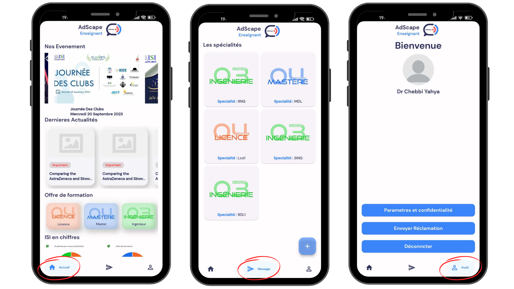

# Adscape: University Interaction & Notification System


**Adscape** is a communication platform that connects university students, professors, and administrators through four integrated applications. It streamlines notifications and announcements to ensure efficient information sharing across the university.

## Applications

### Adscape Etudiant (Mobile App)
**Adscape Etudiant** helps students receive important notifications like class changes or absences, displaying only relevant information for their section.

### Adscape Enseignant (Mobile App)
**Adscape Enseignant** allows professors to send notifications directly to specific student sections, ensuring effective communication.

### Adscape Admin (Web App)
**Adscape Admin** enables the administration to manage notifications and advertisements across the university, with the ability to send content to both students and professors.

### Adscape TV (TV App)
**Adscape TV** displays university-wide notifications and ads on digital screens within the faculty, ensuring everyone stays informed.

## Screenshot
### Adscape Etudiant (Mobile App)


### Adscape Enseignant (Mobile App)





### Adscape Admin (Web App)


### Adscape TV (TV App)


## Tech Stack

- **Flutter**: For building cross-platform mobile applications.
- **Dart**: The programming language used for Flutter apps.
- **Firebase**: Used for real-time data synchronization and storage.
- **Splash Animation**: Custom splash screens on app startup.
- **ListView.builder**: Used for efficient list display within the app.
- **ImagePicker**: For selecting images to upload in the app.

## How to Run

### Apps Setup:

1. Clone the repository:
   ```bash
   git clone https://github.com/ChebbiYahya/University-Interaction-Notification-System.git

2. Navigate to the project directory:
   ```bash
   cd adscape-app

3. Install dependencies:
   ```bash
   flutter pub get

4. Run the app:
   ```bash
   flutter run